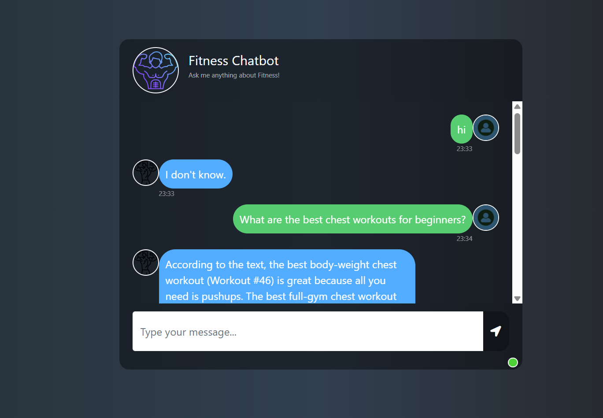

#  Fitness Assistant Bot

This project is a fitness-focused AI chatbot powered by **Google Gemini** (via LangChain), integrated with **Pinecone Vector DB**, and customized with proprietary fitness PDF data.

It provides personalized fitness guidance, workout plans, and general health tips, all contextualized using company-specific fitness documentation.

---




##  Features

- **PDF Data Ingestion** – Reads and processes fitness-related PDF files.
- **Text Chunking** – Splits content into manageable overlapping chunks for better contextual understanding.
- **State-of-the-Art Embeddings** – Uses **`BAAI/bge-large-en-v1.5`**, a top-performing open-source embedding model.
- **Pinecone Vector Database** – Stores vector embeddings and enables fast semantic retrieval.
- **LLM with Gemini** – Answers questions using **Google's Gemini-2.0-Flash** model via LangChain's integration.
- 🌐 **Web App** – Built with Flask for simple browser-based interaction.

---

##  Architecture

```plaintext
+--------------+       +----------------+       +----------------------------+       +----------------+
|  PDF Files   |  -->  |  Text Chunking |  -->  |  Embedding Model (BGE v1.5)|  -->  |  Pinecone DB    |
+--------------+       +----------------+       +----------------------------+       +----------------+
                                                                                              |
                                                                                              v
+-------------------+     User Query      +-------------------------+     Retrieved Data     +---------------------+
|  Flask Web App    |  <----------------  |  LangChain + Gemini LLM |  <-------------------  |  Relevant Embeddings |
+-------------------+                     +-------------------------+                        +---------------------+
```

---

##  Tech Stack

| Component        | Technology                                   |
|------------------|-----------------------------------------------|
|  LLM           | Google Gemini 2.0 Flash (`gemini-pro`)        |
|  Embeddings    | `BAAI/bge-large-en-v1.5` (HuggingFace)        |
|  Vector DB     | Pinecone                                      |
|  Framework     | LangChain + LangChain Community               |
|  Web UI        | Flask                                         |
|  PDF Parsing   | LangChain’s PyPDFLoader                       |
| 🔒 Secrets       | Python Dotenv (`.env`)                        |

---

##  Example Questions to Ask

Once your PDFs are embedded, you can ask:

- `"What are the best workouts for fat loss?"`
- `"How many sets and reps should I do for muscle gain?"`
- `"Summarize the nutrition section from the PDF."`
- `"Explain the difference between HIIT and LISS."`

---

## 🛠️ Setup Instructions

### 1.  Clone the repository

```bash
git clone https://github.com/your-username/fitness-chatbot.git
cd fitness-chatbot
```

### 2.  Create and activate virtual environment

```bash
python -m venv .venv
source .venv/bin/activate   # On Windows: .venv\Scripts\activate
```

### 3.  Install dependencies

```bash
pip install -r requirements.txt
```

### 4.  Add your environment variables in `.env`

```env
PINECONE_API_KEY=your_pinecone_api_key
GOOGLE_API_KEY=your_google_gemini_api_key
```

### 5.  Add PDFs

Place your fitness-related PDF files inside the `/pdfs` directory.

### 6.  Run the embedding & storage script

```bash
python store_index.py
```

This script:

- Loads your PDFs
- Splits the text into chunks
- Creates embeddings
- Stores them in Pinecone vector database

### 7.  Start the chatbot

```bash
python app.py
```

Once running, open your browser and go to:

```
http://localhost:8080
```

---

## 📂 Project Structure

```bash
fitness_chatbot/
│
├── app.py                     # Main Flask app
├── store_index.py             # Embedding + Pinecone storage
├── requirements.txt           # Dependencies
├── .env                       # API Keys
│
├── pdfs/                      # Folder with your fitness PDFs
│
├── src/
│   ├── helper.py              # PDF loader, splitter, embeddings
│   └── prompt.py              # Prompt template (if any custom logic)
│
├── static/
│   └── style.css              # Web UI styles
│
└── templates/
    └── chat.html              # HTML chat interface
```
